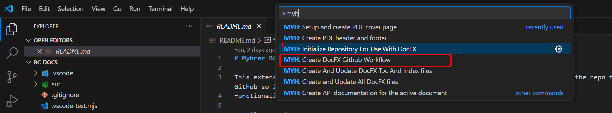
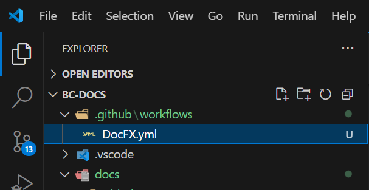
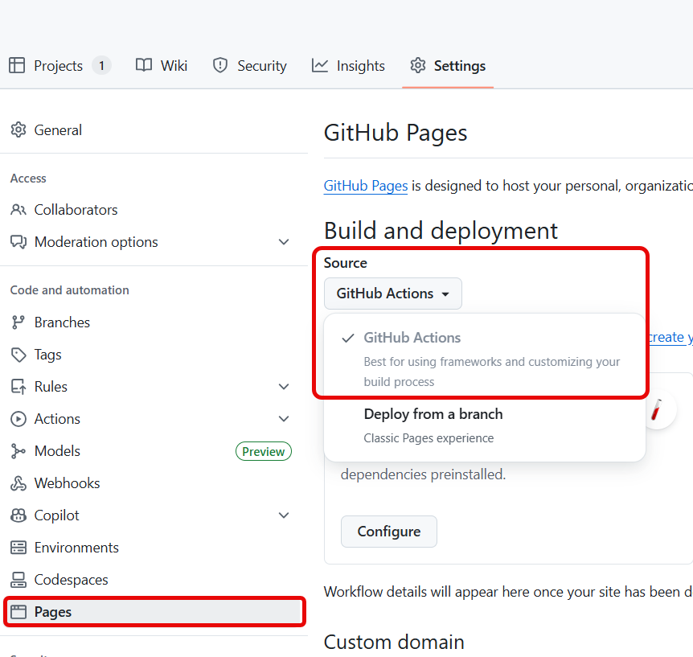

# Github Pages

To get the github pages to be deployed a workflow is needed.
to create and add the workflow to this repo just go to the command palette ctrl+shift+P
type MYH and select this one:

This will create the **.github** and **workflow** folders.

In Github under **settings** in the repo you need to set these setting:

under **pages** you find the **source** field and here it should say **Github Actions**.

> [!NOTE]  
>Your documentation will now be automatic deployed to pages after each build.