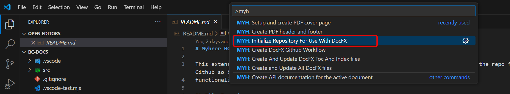
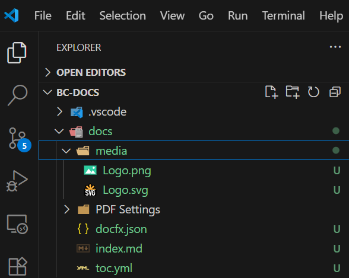

# Initialize the repo for first time use

To do the initialize you go to the command executor ctrl+shift+P

Type **MYH** in the command prompt and you will find these commands:

This Initialize command will create this folder structure:

It creates one Index file and one toc.yml file.

This is the root index file and this is the landing page if someone goes directly to your page.

toc.yml files is used for creation of menus and the name tag in a toc.yml file is the name showed to user.

> [!IMPORTANT]  
> When BC Docs updates the field it will not overwrite the name of the file. if the file exists in the toc.yml file it skips it and do not change it.
