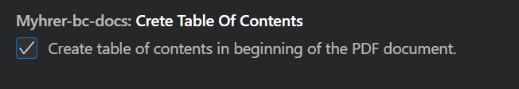
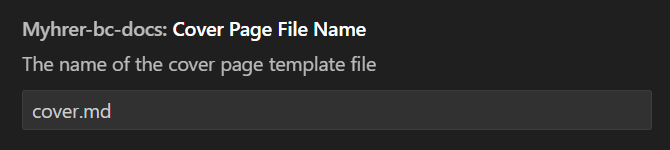
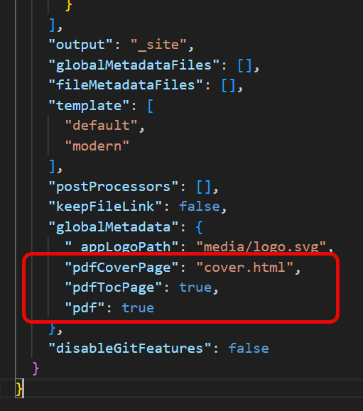

# Cover page and Table of Contents (Toc)

DocFX has the possibility to add a cover page to the created PDFs

To do this we need to turn on cover  page in the settings.
go to **File-Preferences-Settings** and search **MYH**.

Look for this settings:

**CreatePDFCoverPage**

**CreateTableOfContents**

**CoverPageFileName**

The filename is default cover.md but here you can override it if needed.

After **CreatePDFCoverPage** and **CreateTableOfContents** are ticked off then you run this command to set it up:

**MYH: Setup and create PDF cover page**

this will result in these changes

The file **cover.md** is created and filled with a template. this template can you configure and make like you want with html code.

when you update the files with the 
****MYH: Create and Update All DocFX files**** command you will se this changes in the docfx.json file

As we can se the tag for cover page and table of contents is added to the file.

