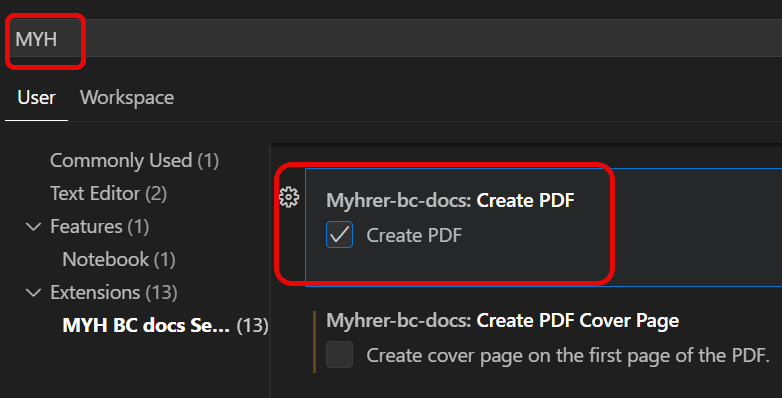
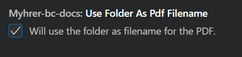

# PDF Setup

DocFX has the capability to create PDF files of the markdown files.
to turn this feature on you need to go to vscode **File-Preferences-Settings** and search for **MYH**
find the setting **Create PDF**

When this is ticked off a button will appear in bottom of each md file that will let you download the PDF.

As default docFX gives the pdf file the name Toc.pdf. This can be overruled by this settings for filename

under Settings you find the setting **UseFolderAsPdfFilename**

>[!NOTE] 
>With these simple settings turned on you will get a button to download the pdf from.

## Advanced Settings
