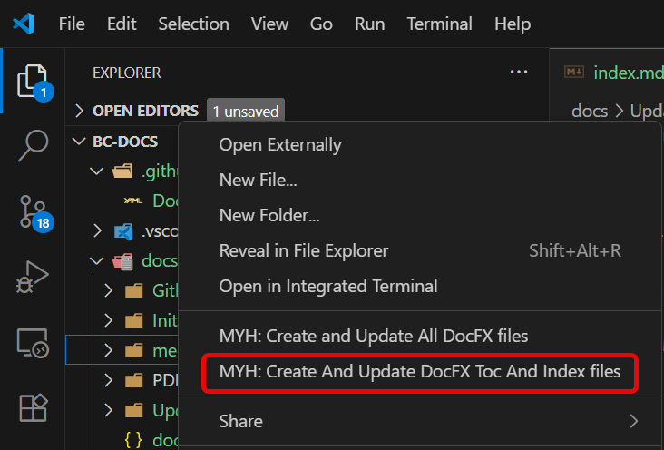

# Updating the files

when a new folder or a new markdown file is created the toc.yml files needs an update.

If you create a new folder you will need to update docfx.json.

the easiest way to to this is to run the command:

**MYH: Create and Update All DocFX files**

This will update all files that need updates. Both docfx.json and the toc.yml files and if no index file in a empty folder then it will create one.

this function is also on the right click menu in the explorer window.

If only added new md files it is only needed to run this command:

**MYH: Create And Update DocFX Toc And Index files**

This will only affect the toc and Index files. and if a file is mentioned in the toc.yml file it will not update the toc so the information will not be overwritten.
new files will be added at the bottom of the toc.yml file.

this function is also on the right click menu in the explorer window.

